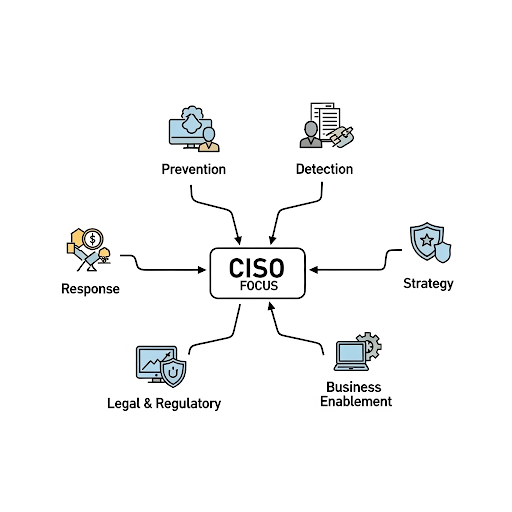

# CISO MIND MAP

El documento de SANS presenta los  **"CISO Mind Map"** y los **"Essential Functions"** de un Centro de Operaciones de Seguridad (SOC). 
El póster está diseñado para ayudar a los líderes cibernéticos a construir y dirigir un equipo de seguridad de primera clase. Proporciona una visión completa de las responsabilidades de un CISO y las funciones de un SOC, cubriendo áreas como la prevención, detección, respuesta, y la gestión de riesgos

  

 ## 1
 ## 2
 ## 3
 ## 4
 ## 5

