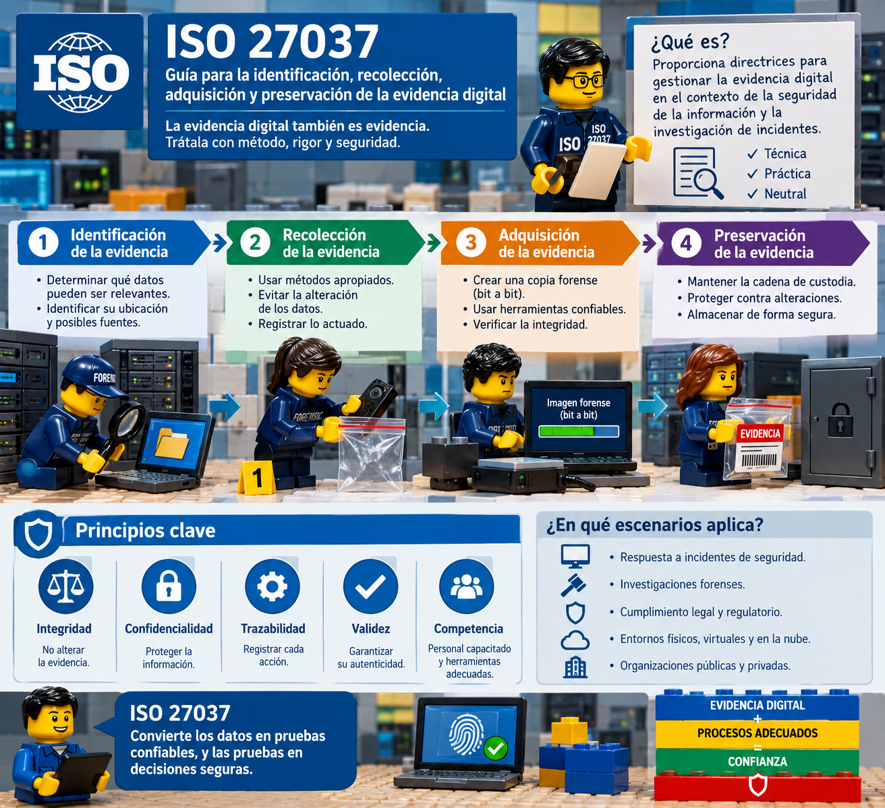

# Taller Práctico Avanzado: Intervención Forense en Escenario de Crisis y Cadena de Custodia bajo ISO/IEC 27037

### 1. Ficha Técnica de la Actividad

* **Asignatura:** Informática Forense.
* **Programa:** Maestría en Ciberseguridad y Ciberdefensa.
* **Metodología:** Aprendizaje Basado en Problemas (ABP), juego de roles y simulación de incidentes en infraestructura crítica / defensa.
* **Modalidad de trabajo:** Tres (3) equipos multidisciplinarios (3 a 5 estudiantes por equipo).

---

### 2. Entregables Formales Obligatorios por Equipo

Cada equipo debe elaborar y disponer para la sesión académica los siguientes productos:

1. **Dossier Técnico Pericial (Documento escrito / PDF):**
* Respuestas analíticas y fundamentadas a las preguntas clave del caso asignado.
* **Formato 1 diligenciado:** Bitácora de Triaje y Justificación Técnica de la Intervención.
* **Formato 2 diligenciado:** Registro de Cadena de Custodia y Trazabilidad (Anexo B, ISO 27037).

2. **Presentación de Sustentación Pericial (PowerPoint - PPTX):**
* Diapositivas preparadas para la defensa pericial de **10 minutos** en clase.
* **Estructura obligatoria de la presentación:**
* *Diapositiva 1:* Carátula formal con integrantes, roles normativos asignados y referencia operacional del caso.
* *Diapositiva 2:* Resumen ejecutivo de la escena intervenida y delimitación del alcance del mandato judicial.
* *Diapositivas 3-4:* Diagrama de flujo de toma de decisiones técnicas (fundamentado en las Figuras 1 a 5 de la norma).
* *Diapositiva 5:* Procedimiento de preservación, contención de riesgos y orden de volatilidad aplicado.
* *Diapositiva 6:* Consolidado de evidencias materiales aseguradas, tipo de empaque técnico y funciones resumen (*hash*).
* *Diapositiva 7:* Matriz de defensa técnica frente a posibles acusaciones de alteración (*spoliation*) o sesgo (*inherent bias*).

3. **Defensa Oral y Juicio de Admisibilidad (En Aula):**
* Exposición oral pericial del equipo sustentante (10 minutos).
* Fase de contra-interrogatorio frente al tribunal docente y los grupos pares que actúan como contraparte pericial (10 minutos).

# NOTA:  Dentro de este mismo README, cada grupo debe subir sus evidencias en una carpeta y un README.md  ( nomenclatura carpeta -->  Grupo 1, Grupo 2)

---

### 3. Marco Normativo y Fundamentos Teóricos Obligatorios

Los equipos deberán fundamentar todas sus decisiones técnicas, procedimentales y jurídicas en:

1. **Los 4 pilares de la evidencia digital:** Auditabilidad (5.3.2), Repetibilidad (5.3.3), Reproducibilidad (5.3.4) y Justificabilidad (5.3.5).
2. **Las 4 fases del ciclo de vida:** Identificación (5.4.2), Recolección (5.4.3), Adquisición (5.4.4) y Preservación (5.4.5).
3. **Roles operativos:** Primer Respondedor (*Digital Evidence First Responder* - DEFR) y Especialista en Evidencia Digital (*Digital Evidence Specialist* - DES).
4. **Orden de volatilidad y datos en vivo:** Manejo de RAM, procesos, conexiones y contenedores cifrados previo a la desconexión o apagado (RFC 3227 y numeral 6.8 de la norma).
5. **Mitigación del sesgo inherente (*Inherent Bias*):** Neutralidad en la toma de decisiones basada en el *briefing* (numeral 6.7.5).

---

### 4. Contextualización del Escenario General

> Se ha detectado una fuga masiva de información clasificada y señales de persistencia avanzada (APT) en la sede de enlace de una agencia de mando y control del sector defensa. La alerta temprana sugiere que se han utilizado credenciales comprometidas y dispositivos no autorizados para exfiltrar fragmentos de planes operacionales hacia redes externas. El equipo forense recibe un mandato judicial/militar y un *briefing* inicial con tiempo limitado para intervenir y asegurar los potenciales elementos de evidencia física y lógica.

---

### 5. Estructura y Roles Operativos por Equipo

Cada equipo distribuirá internamente las siguientes responsabilidades periciales:

1. **DEFR Líder de Escena:** Coordina la seguridad física y lógica del perímetro, evalúa riesgos en escena (6.2), valida el mandato legal y firma la apertura de actas.
2. **Especialista en Evidencia Digital (DES):** Diseña y ejecuta la estrategia técnica de adquisición en vivo vs. recolección física, supervisa el orden de volatilidad y valida las herramientas estáticas forenses.
3. **Oficial de Registro y Cadena de Custodia:** Diligencia formalmente los inventarios y registros de cadena de custodia (Anexo B), calcula las funciones resumen (MD5/SHA-256) y administra el empaque técnico (antiestático/Faraday).
4. **Auditor de Calidad y Cumplimiento Normativo (Obligatorio en grupos de 4 o 5; asumido por el DEFR en grupos de 3):** Contrasta en tiempo real que cada acción cumpla los principios de auditabilidad, repetibilidad, reproducibilidad y justificabilidad para prevenir acusaciones de *spoliation*.

---

### 6. Cronograma de Ejecución en Clase (150 Minutos)

| Fase | Duración | Actividad y Objetivos Operativos |
| --- | --- | --- |
| **Parte I: Gabinete y Triaje Documental** | **90 min** | • **00–20 min:** Análisis de caso, verificación del mandato legal y selección de herramientas estáticas. 

 • **20–60 min:** Resolución de preguntas técnicas, aplicación de diagramas de decisión y triaje de volatilidad. 

 • **60–90 min:** Diligenciamiento formal de Formatos 1 y 2, y compilación final de la presentación en PowerPoint. |
| **Parte II: Sustentación y Juicio de Admisibilidad** | **60 min** | • **90–110 min:** Sustentación y contra-interrogatorio Grupo 1. 

 • **110–130 min:** Sustentación y contra-interrogatorio Grupo 2. 

 • **130–150 min:** Sustentación y contra-interrogatorio Grupo 3. |

---

### 7. Casos Detallados y Fichas de Inventario Simulado

---

#### GRUPO 1: Estación de Operaciones Crítica Encendida con Volúmenes Cifrados

*Alineación normativa: Numerales 5.3, 5.4, 6.2, 6.6, 6.8, 7.1.1, 7.1.2.1, 7.1.3.1; Figuras 1, 2 y 4.*

* **Referencia Operacional:** Caso OPE-DEF-2026-088.
* **Contexto:** Se comisiona al equipo DEFR/DES para intervenir la oficina del Director de Proyectos Especiales del Comando Conjunto de Ciberdefensa. Las alertas del SIEM indican tráfico anómalo masivo mediante túneles DNS hacia un servidor en el extranjero.
* **Situación de la Escena al arribar (09:15 horas):**
* La estación de trabajo principal se encuentra **encendida** (*powered-on*).
* La pantalla está activa y desbloqueada gracias a un dispositivo USB desconocido conectado en el panel frontal que emula actividad continua de ratón (*mouse jiggler*).
* En pantalla se observan dos consolas de PowerShell abiertas, una ventana de explorador de archivos con una unidad montada `V:\ (Volumen Seguro)` y una sesión activa de mensajería instantánea cifrada.
* El cable de red RJ-45 está conectado a la roseta de pared y el LED de actividad parpadea intensamente.
* El funcionario investigado no se encuentra presente, pero sobre el teclado hay una nota adhesiva manuscrita con palabras clave y credenciales tentativas.

**Ficha de Inventario y Evidencia Simulada (Grupo 1):**

| ID Ítem | Descripción del Elemento | Estado Inicial | Particularidades Técnicas / Identificadores |
| --- | --- | --- | --- |
| **G1-E01** | Torre Workstation Dell Precision 5820 | Encendido (En ejecución) | S/N: 4HG78Y2; CPU Xeon, 64 GB RAM, 2x 1TB NVMe en RAID 0. Conexión Gigabit Ethernet activa. |
| **G1-E02** | Pantalla Dell UltraSharp 27" | Encendido | S/N: DL-99214; Muestra escritorio con volúmenes montados y consolas activas. |
| **G1-E03** | Dongle USB metálico sin marca | Conectado (Frontal) | Identificado lógicamente como HID USB (*Mouse Jiggler* continuo). |
| **G1-E04** | Nota adhesiva (Post-it amarillo) | Sobre el teclado | Contiene texto manuscrito: *"AES-K: Gr@n4d0_2026! // VPN: C2-Ext"*. |
| **G1-E05** | Cable de alimentación AC y UPS | Conectado a UPS APC 1500VA | El equipo cuenta con respaldo eléctrico activo de batería. |

**Preguntas Clave y Retos Metodológicos:**

1. Siguiendo el árbol de decisión de la Figura 1 y 4: ¿Se debe realizar adquisición en vivo (*live acquisition*) o recolección física directa (*collection*)? Justificar con base en el concepto de *volatile data* (sección 3.26 y 6.8).
2. ¿Cómo se aísla la estación de la red para mitigar el riesgo de una instrucción remota de borrado (*logic-bomb* o autodestrucción) sin alterar las tablas ARP y conexiones TCP/IP activas (numerales 6.2.3 y 7.2.2.2)?
3. En caso de extraer la memoria RAM: ¿Qué consideraciones técnicas de la norma (numeral 7.1.3.1.2) deben aplicarse respecto a herramientas estáticas de confianza, desplazamiento de memoria (*paging*) y cálculo de hash?
4. ¿Cuál es el procedimiento normativo para apagar o transportar el equipo garantizando que los datos no se corrompan si el disco estuviera parcialmente cifrado (Figura 2 y nota 1 del 7.1.2.1.2)?

---

#### GRUPO 2: Vectores Móviles, Medios Extraíbles y Manejo del Sesgo

*Alineación normativa: Numerales 6.7.5, 6.9, 7.1.3.5, 7.2.1, 7.2.2.1, 7.2.2.3.*

* **Referencia Operacional:** Caso OPE-DEF-2026-089.
* **Contexto:** Durante una inspección contrainteligencia imprevista en un Puesto de Mando Unificado, se interviene a un oficial de comunicaciones sospechoso de filtrar coordenadas tácticas a través de aplicaciones celulares y dispositivos externos.
* **Situación de la Escena al arribar:**
* El oficial está sentado con un teléfono inteligente Samsung Galaxy encendido sobre la mesa, con la pantalla bloqueada mediante patrón biométrico/PIN.
* En el bolsillo de su chaleco se encuentra una memoria USB rotulada *"Música Personal - MP3"*. El oficial insiste repetidamente: *"No pierdan el tiempo con esa memoria, solo tiene música de mi uso personal, revisen el computador del compañero que él sí maneja las órdenes de marcha"* (Tentativa explícita de inducir sesgo investigativo).
* En una gaveta abierta se observa una tarjeta MicroSD suelta de 128 GB, adaptadores de SIM y un dongle USB Wi-Fi de alta potencia configurado en modo monitor.
* Las redes celulares 4G/5G y la red Wi-Fi táctica tienen cobertura total y alta potencia en el recinto.

**Ficha de Inventario y Evidencia Simulada (Grupo 2):**

| ID Ítem | Descripción del Elemento | Estado Inicial | Particularidades Técnicas / Identificadores |
| --- | --- | --- | --- |
| **G2-E01** | Smartphone Samsung Galaxy S23 | Encendido / Bloqueado | IMEI: 358912345678901; Conectado a Wi-Fi y red móvil LTE; batería al 38%. |
| **G2-E02** | Unidad Flash USB Kingston DataTraveler 64GB | Desconectada | Etiquetada a mano *"Música Personal"*; conector tipo USB 3.2. |
| **G2-E03** | Tarjeta MicroSD SanDisk Extreme 128GB | Suelta (sin adaptador) | S/N: SD-88301-C10; sin rotulación visible. |
| **G2-E04** | Tarjeta nano-SIM (en el teléfono G2-E01) | Insertada | Operador Claro Colombia; ICCID visible parcialmente en bandeja. |
| **G2-E05** | Adaptador USB Wi-Fi Alfa Network AWUS036ACM | Desconectado | Antenas desmontables de alta ganancia; chipset compatible con inyección de paquetes de red. |

**Preguntas Clave y Retos Metodológicos:**

1. Respecto a la manifestación del sospechoso sobre la memoria USB: ¿Cómo se fundamenta metodológicamente la actuación del DEFR frente al **sesgo inherente (*inherent bias*)** según el numeral 6.7.5 de la ISO 27037?
2. ¿Cuáles son los riesgos inmediatos asociados al teléfono encendido (bloqueo por temporizador, comandos de borrado remoto vía servicios cloud, recepción de tráfico push) y qué medidas de aislamiento físico/RF y preservación energética exige la norma (numerales 6.9.2 y 7.2.2.3)?
3. Si el teléfono se coloca dentro de una bolsa/jaula de Faraday: ¿Qué ocurre con el consumo de batería debido al incremento de potencia de emisión y cómo debe proceder el DEFR para evitar la pérdida del estado encendido (numeral 6.9.2 nota técnica)?
4. Para la tarjeta MicroSD y la memoria USB: Describir la secuencia de preservación física (materiales antiestáticos, precintos) y adquisición forense (bloqueador de escritura y cálculo de hash).

---

#### GRUPO 3: Infraestructura de Almacenamiento Centralizado (NAS/RAID) y Sistema CCTV

*Alineación normativa: Numerales 6.5, 6.6, 7.1.3.3, 7.1.3.4, 7.3.*

* **Referencia Operacional:** Caso OPE-DEF-2026-090.
* **Contexto:** Se ha detectado la manipulación y borrado de bitácoras de auditoría en un servidor central que soporta operaciones logísticas conjuntas. Simultáneamente, se sospecha que una persona no autorizada ingresó físicamente al centro de cableado para conectar un dispositivo de espionaje (*drop-box*) durante el fin de semana.
* **Situación de la Escena al arribar:**
* En el rack de comunicaciones se encuentra un servidor de almacenamiento en red **NAS Synology RackStation** con 8 bahías en arreglo **RAID 5**. El sistema presta servicios simultáneos e ininterrumpidos al área médica y de transporte de la institución militar (sistema de misión crítica).
* En el mismo bastidor opera un grabador de video digital en red (**NVR/CCTV Hikvision**) conectado a 16 cámaras IP, con 4 discos duros internos grabando en bucle.
* La orden judicial autoriza únicamente la búsqueda y extracción de información relacionada con el directorio `/vol1/operaciones_especiales/` y las grabaciones de video del pasillo de acceso entre las 02:00 y las 06:00 horas del 2 de octubre de 2026.

**Ficha de Inventario y Evidencia Simulada (Grupo 3):**

| ID Ítem | Descripción del Elemento | Estado Inicial | Particularidades Técnicas / Identificadores |
| --- | --- | --- | --- |
| **G3-E01** | Servidor NAS Synology RS2423+ | En producción / Crítico | S/N: 2280SYN-9011; 8 discos HDD SATA de 4TB en RAID 5 (28 TB útiles). Aloja datos de múltiples áreas. |
| **G3-E02** | Unidad NVR CCTV Hikvision DS-7716NI | En grabación continua | S/N: HK-88402-V; Reloj interno desincronizado con respecto al NTP nacional. 16 canales activos. |
| **G3-E03** | Switch de Distribución Cisco Catalyst 3850 | Operacional | Conexiones de fibra óptica y cobre interconectando el NAS, NVR y red troncal. |
| **G3-E04** | Monitor de Gestión y Consola KVM | En reposo | Conectado directamente a las interfaces de video del NAS y del NVR. |

**Preguntas Clave y Retos Metodológicos:**

1. Frente al servidor NAS: Considerando que es un sistema de misión crítica (*mission-critical system*) que comparte almacenamiento con unidades operativas y médicas inocentes (numerales 6.5 y 7.1.3.3): ¿Por qué es técnicamente inadmisible apagar el equipo o remover físicamente los discos duros?
2. ¿Cómo se planifica y documenta una **adquisición parcial / lógica (*partial/logical acquisition*)** conforme a los numerales 5.4.4 y 7.1.3.4, garantizando que no se extraiga información por fuera del mandato legal?
3. En el sistema CCTV (numeral 7.3):
* ¿Por qué es crítico documentar el desfase temporal (*time offset*) del reloj del grabador frente a una fuente horaria confiable y trazable antes de iniciar la exportación?
* ¿Qué riesgos probatorios existen si se decide exportar el video recodificándolo a formato AVI o MPEG genérico en lugar de exportar el flujo nativo propietario junto con su reproductor validado (*player software*)?

4. ¿Qué acciones deben realizarse para verificar que el NVR continúe su funcionamiento normal tras la extracción de las secuencias requeridas (numeral 7.3)?

---

### 8. Formatos Estandarizados Obligatorios

---

#### FORMATO 1: Bitácora de Triaje y Justificación Técnica de la Intervención

*(Entregable obligatorio del grupo sustentante | Alineado con 5.3.2 - Auditabilidad y 5.3.5 - Justificabilidad).*

* **Número de Caso:** __________________________________ **Fecha y Hora de Arribo:** ____________________
* **Equipo Pericial Responsable:** ____________________________________________________________________
* **Mandato Legal y Autoridad Emisora:** _______________________________________________________________
* **Evaluación Inicial de Riesgos en Escena (Riesgos físicos y lógicos - Numeral 6.2):**
---

**Matriz de Decisiones Técnicas:**

| ID Dispositivo | Estado Inicial (ON / OFF) | ¿Contiene Datos Volátiles Críticos? (Sí / No) | Determinación Operativa (Colección Física vs. Adquisición en Vivo/Lógica) | Fundamentación Normativa (Cláusula ISO 27037) | Alteraciones Técnicas Inevitables Introducidas |
| --- | --- | --- | --- | --- | --- |
|  |  |  |  |  |  |
|  |  |  |  |  |  |
|  |  |  |  |  |  |

---

#### FORMATO 2: Registro de Cadena de Custodia y Trazabilidad de Evidencia

*(Entregable obligatorio del grupo sustentante | Alineado con numeral 6.1 y Anexo B de ISO/IEC 27037:2016).*

* **Referencia del Caso / Expediente:** _________________________________________________________________
* **Entidad / Unidad Investigadora:** ___________________________________________________________________
* **Ubicación Exacta de la Escena:** __________________________________________________________________

**Registro de Elementos Materiales Probatorios:**

| Ítem N° | Descripción Detallada (Marca, Modelo, S/N) | Tipo de Empaque (Antiestático / Faraday / Rígido) | Número de Precinto / Sello de Seguridad | Algoritmo Hash (MD5 / SHA-256) | Valor Hash Verificado | Nombre, Rol y Firma del Receptor |
| --- | --- | --- | --- | --- | --- | --- |
|  |  |  |  |  |  |  |
|  |  |  |  |  |  |  |
|  |  |  |  |  |  |  |

**Control de Movimiento y Transferencia de Custodia:**

* **Entrega:** ____________________________ **Cargo:** __________________ **Fecha/Hora:** ______________ **Firma:** ________________
* **Recibe:** _____________________________ **Cargo:** __________________ **Fecha/Hora:** ______________ **Firma:** ________________
* **Propósito del Traslado:** [  ] Almacenamiento seguro en bodega de evidencias | [  ] Traslado a laboratorio pericial

---

