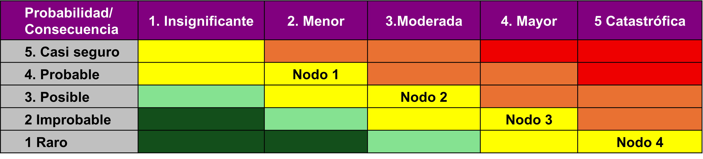

## NTC-IEC/ISO 31010:2020 ##
### Fase 1 – Estudio dirigido y comprensión profunda ###

## Analizar las técnicas asignadas usando el Anexo B. ##

### Análisis Multicriterio (AMC) ###

Esta técnica se utiliza para comparar opciones de manera que las soluciones intermedias (trade-offs) se hagan explícitas. Es una alternativa al análisis de costo/beneficio que no requiere asignar un valor monetario a todos los elementos.

* **Aplicación principal:** Selección entre opciones.
*	**Alcance:** Aplicable a nivel organizacional, de proyecto o de proceso.
*	**Nivel de decisión:** Cualquiera (estratégico, táctico u operacional).
* **Atributos técnicos:** Es una técnica principalmente cualitativa que requiere un esfuerzo bajo a medio y conocimientos especializados moderados.
* **Análisis experto:** En ciberdefensa, el AMC es vital para seleccionar herramientas de seguridad donde factores como la usabilidad, el soporte técnico y el cumplimiento normativo son tan críticos como el precio.

### Análisis Costo/Beneficio  ###

Utiliza el dinero como escala común para estimar las consecuencias positivas y negativas (tangibles e intangibles) de diferentes opciones de decisión.

* **Aplicación principal:** Comparar opciones para seleccionar la más eficiente financieramente.
*	**Horizonte de tiempo:** Corto o medio plazo.
* **Atributos técnicos:** Es una técnica cuantitativa que requiere un nivel de esfuerzo y conocimientos especializados de medio a alto.
*	**Análisis experto:** Es la herramienta base para justificar el ROI (Retorno de Inversión) en proyectos de infraestructura de seguridad ante la alta dirección.

 ### ALARP / ALARA y SFAIRP ###

Son criterios para decidir sobre la importancia del riesgo y determinar su tolerabilidad.

*	**ALARP:** As Low As Reasonably Practicable (Tan bajo como sea razonablemente viable).
*	**SFAIRP:** So Far As Is Reasonably Practicable (Siempre y cuando sea razonablemente viable).
*	**Aplicación principal:** Valoración del riesgo y determinación de si el riesgo es aceptable o requiere tratamiento adicional.
*	**Atributos técnicos:** Puede ser cualitativa o cuantitativa y requiere un alto nivel de conocimientos especializados y esfuerzo.
*	**Análisis experto:** En ciberdefensa, se aplica para determinar el "riesgo residual" aceptable tras implementar controles, reconociendo que eliminar el riesgo al 100% es económicamente inviable.

###	Índices de Riesgo (Ranking de Riesgos) ###

Esta técnica clasifica la importancia de los riesgos mediante la aplicación de calificaciones a los factores que influyen en su magnitud.

*	**Aplicación principal:** Comparar y jerarquizar riesgos para priorizar su tratamiento.
*	**Atributos técnicos:** Es una técnica semicuantitativa. Su uso es sencillo (esfuerzo bajo), pero su desarrollo requiere conocimientos especializados moderados.
*	**Análisis experto:** Es fundamental en la fase de triaje de vulnerabilidades. Permite a los equipos de seguridad enfocarse en las amenazas críticas (ej. vulnerabilidades críticas en servidores expuestos) antes que en las menores.

## Comparativo de técnicas: ##

Técnica	Tipo de Datos	Propósito Principal	Complejidad
AMC	Cualitativo	Decidir entre opciones complejas 	Moderada
Costo/Beneficio	Cuantitativo	Eficiencia económica de la decisión 	Alta
ALARP/ALARA	Cualitativo/Cuantitativo	Determinar tolerabilidad del riesgo 	Alta
Índices de Riesgo	Cualitativo/Cuantitativo	Clasificar y priorizar riesgos 	Baja

## Matriz Comparativa:

## Fase 2 – Aplicación práctica en escenario de Ciberseguridad/Ciberdefensa ##

### Escenario realista: Operación "Blackout" ###

Un actor de amenaza tipo APT (respaldado por un Estado o grupo criminal de élite) ha logrado infiltrarse en la red de Tecnología de Operación (OT) de una central hidroeléctrica mediante un compromiso inicial en la red corporativa (IT) vía spear-phishing. El objetivo es el despliegue de un malware diseñado para manipular los Sistemas de Control Supervisorio y Adquisición de Datos (SCADA), provocando una apertura no sincronizada de interruptores que resultaría en daños físicos a las turbinas y un apagón regional prolongado.

Aplicación en técnicas: Análisis Costo/Beneficio (ACB) y ALARP / ALARA 

## Justificación según ISO 31010

### Análisis Costo/Beneficio (ACB) ###

Esta técnica utiliza el dinero como escala común para estimar las consecuencias positivas y negativas de las opciones de tratamiento.

*	**Costo de Implementación:** Inversión en segmentación de red (firewalls industriales), implementación de un SOC 24/7 y sistemas de detección de intrusiones (IDS) específicos para protocolos industriales (ej. DNP3 o Modbus).
* **Beneficio (Evitación de Pérdida):** Valoración del ahorro al evitar multas regulatorias, reparaciones de infraestructura física (turbinas), indemnizaciones por falta de servicio y el impacto económico nacional por el cese de suministro.
*	**Justificación ISO 31010:** Es adecuada porque permite a la alta dirección tomar decisiones estratégicas basadas en el Retorno de Inversión en Seguridad (ROSI), comparando el gasto en ciberdefensa frente al impacto financiero catastrófico del ataque.

###	ALARP / ALARA ###

Criterios utilizados para determinar si el riesgo de un evento es "tan bajo como sea razonablemente viable".

*	**Aplicación:** En una infraestructura crítica, el riesgo de un apagón total nunca es cero. Se aplica ALARP para demostrar que se han implementado todos los controles posibles hasta un punto donde el costo de una reducción adicional sea groseramente desproporcionado frente al beneficio de seguridad obtenido.
*	**Justificación ISO 31010:** Es la técnica idónea para la valoración del riesgo en sectores donde existen consecuencias para la vida humana y la estabilidad social, proporcionando una base legal y ética para la aceptación del riesgo residual.

Riesgos, incertidumbres y consecuencias

### Resultados y limitaciones del ejercicio ###

## Resultados del Ejercicio ##

*	**Decisión Informada:** El ACB justifica un presupuesto de 2M USD en ciberdefensa para proteger activos valorados en 500M USD con una probabilidad de ataque anual estimada.
*	**Tolerancia:** El marco ALARP establece que, aunque persiste una incertidumbre residual por la sofisticación de la APT, los controles de "defensa en profundidad" cumplen con la debida diligencia legal.

## Limitaciones ##

*	**Dificultad de Valoración:** Asignar un valor monetario exacto a la "seguridad nacional" o la "pérdida de vidas" en un ACB es complejo y a menudo controvertido.
*	**Naturaleza Dinámica de la APT:** Las APT evolucionan más rápido de lo que los modelos de ACB pueden actualizarse; un control que hoy es costo-beneficioso, mañana puede ser irrelevante ante una nueva técnica de ataque.
*	**Sesgos Humanos:** La evaluación de la posibilidad de un ataque de este tipo a menudo sufre de un exceso de confianza en los controles actuales o sesgos de disponibilidad.

### Análisis de Consecuencias y Probabilidades ###

Esta matriz visualiza la importancia relativa de los eventos del ataque para priorizar los controles.

### Análisis Técnico de los Nodos Críticos

* **Nodo 1:** Acceso Inicial (Phishing/Ingeniería Social)
Probabilidad: Probable (4). Los vectores humanos son los puntos de entrada más frecuentes.
Consecuencia: Menor (2). El acceso a la red IT corporativa no implica control directo sobre la generación de energía.

* **Nodo 2:** Pivote IT a OT (Salto de Segmentación)
Probabilidad: Posible (3). Depende de la robustez de las reglas de firewall y el uso de zonas desmilitarizadas (DMZ) industriales.
Consecuencia: Moderada (3). Permite al atacante observar el tráfico de control y realizar reconocimiento de activos SCADA.

* **Nodo 3:** Compromiso de Estación de Ingeniería
Probabilidad: Improbable (2). Requiere técnicas avanzadas de escalada de privilegios y bypass de controles de autenticación fuerte (MFA).
Consecuencia: Mayor (4). Es el "punto de no retorno"; permite reprogramar la lógica de control de los PLC.

* **Nodo 4:** Manipulación de Lógica PLC y Daño Físico
Probabilidad: Raro (1). Exige un conocimiento profundo del proceso físico de la hidroeléctrica y la evasión de enclavamientos mecánicos.
Consecuencia: Catastrófica (5). Destrucción de activos físicos (turbinas), pérdida total del servicio y riesgo para la vida humana.

### Interpretación para la Toma de Decisiones ###

*	**Zona de Alerta (Rojo - Nodo 4):** Aunque la probabilidad es "Rara", su ubicación en el extremo de consecuencia catastrófica exige la aplicación del criterio ALARP. No se puede aceptar este riesgo sin controles de seguridad intrínseca (no solo digitales, sino protecciones físicas/mecánicas independientes).

*	**Zona Operativa (Naranja/Amarillo - Nodos 1 y 2):** Son eventos de "alta frecuencia - bajo impacto". Deben gestionarse mediante monitoreo continuo (SOC) y concientización para reducir la probabilidad de éxito de la APT en las fases tempranas.

*	**Uso de la Matriz:** Esta técnica permite demostrar a la dirección que los recursos deben enfocarse en el Nodo 3, ya que es el facilitador del impacto catastrófico.

### Limitaciones del Ejercicio según ISO 31010 ###

*	**Pérdida de Información:** Al combinar consecuencia y posibilidad en un valor único, se puede perder la distinción entre riesgos de alta consecuencia y baja probabilidad frente a los frecuentes de bajo impacto.
*	**Subjetividad:** La asignación de niveles depende del juicio de expertos, el cual puede estar sesgado por eventos recientes.

Elaborador: Johana Lambuley – David Mora – Jesus David Díaz – Fabián Gómez

Asignatura: Gestión de Riesgos Cibernéticos - MAECI - 2026.

Maestría: Ciberseguridad y Ciberdefensa.

Semestre: 2.

Corte: II 2025.
