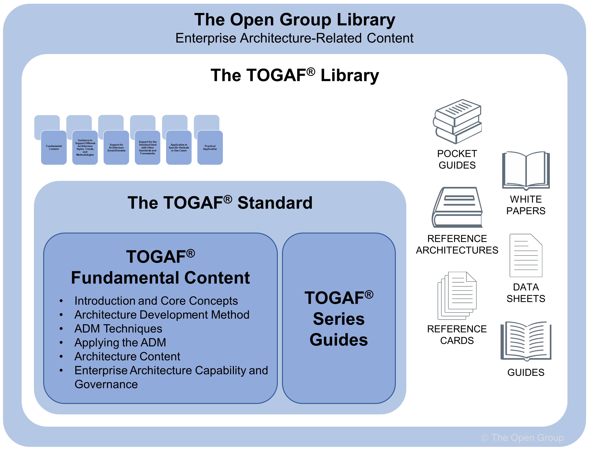
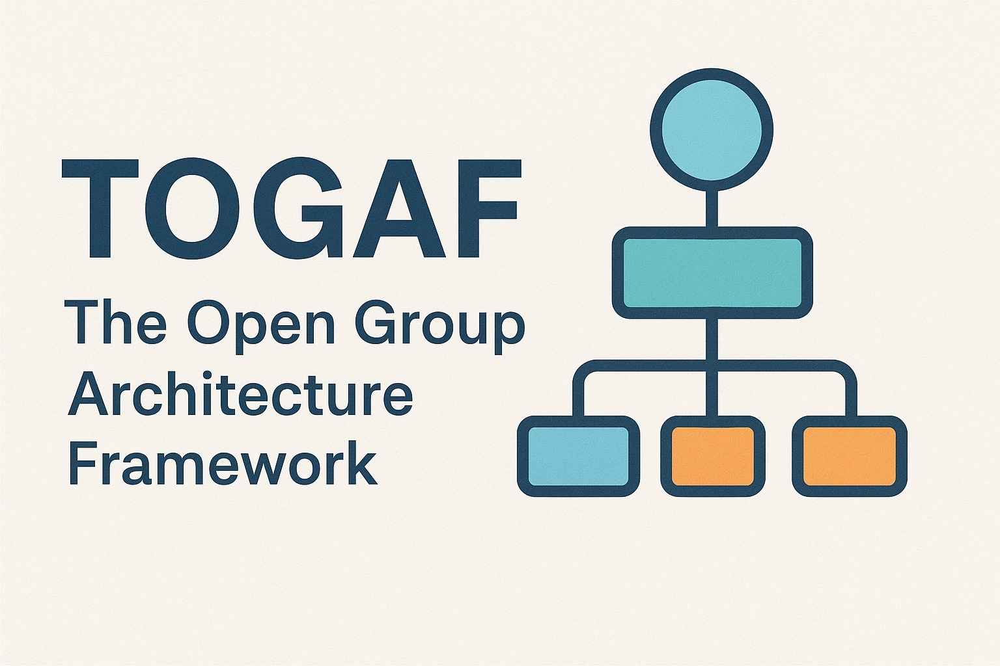
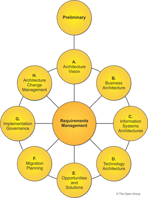
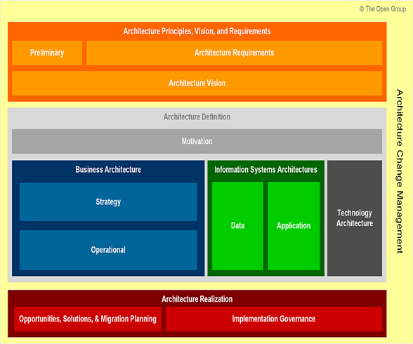
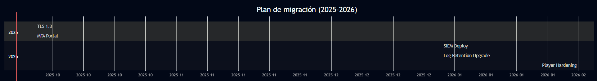
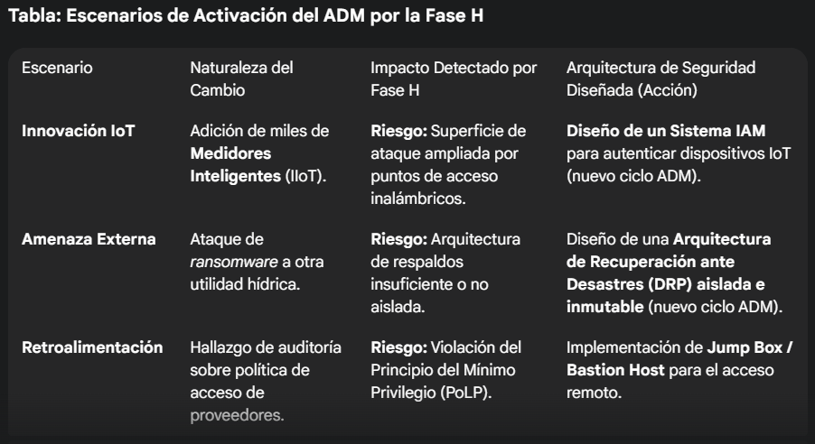
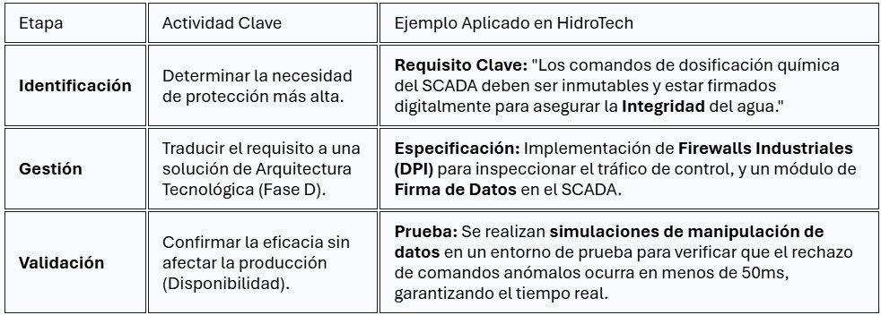
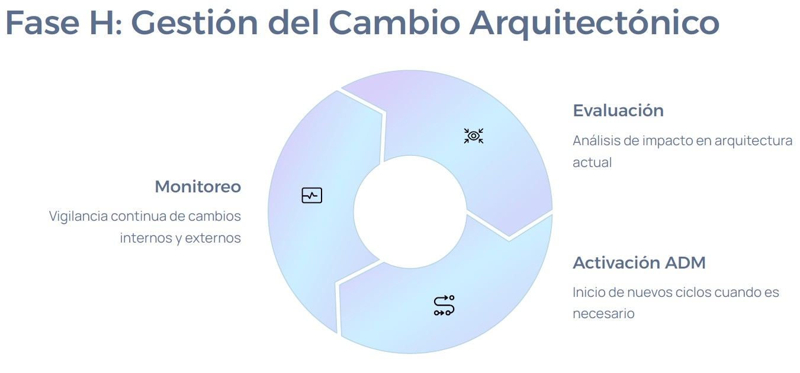
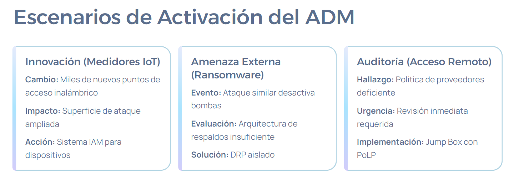
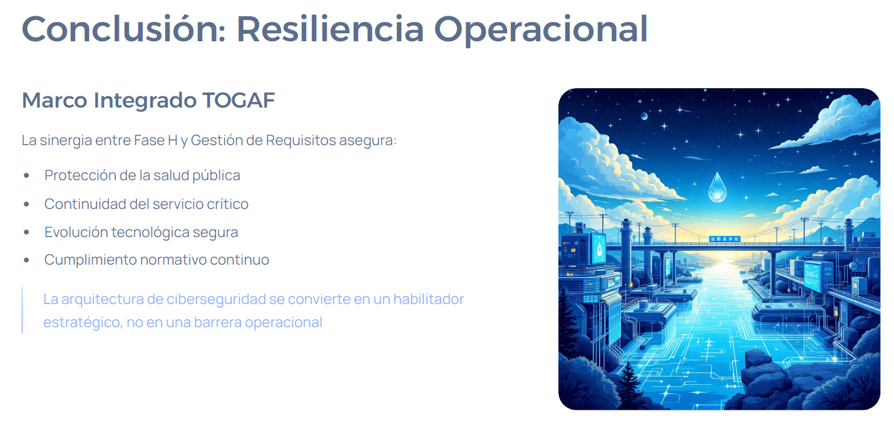

# Parcial Tercer Corte: Aplicación de TOGAF en Ciberseguridad

## Propósito del Trabajo
El objetivo principal de este trabajo es aplicar el marco de arquitectura empresarial **TOGAF (The Open Group Architecture Framework)** para diseñar y gestionar la ciberseguridad en una organización. A través de un enfoque práctico y colaborativo, los estudiantes de la Maestría en Ciberseguridad y Ciberdefensa aprenderán a alinear la estrategia de seguridad con los objetivos de negocio mediante la aplicación de las fases del **Architecture Development Method (ADM)**. Este trabajo combina teoría y práctica para desarrollar una arquitectura de ciberseguridad coherente, adaptable y alineada con las necesidades organizacionales.

### Importancia en la Gestión de la Ciberseguridad
La ciberseguridad es un pilar estratégico en las organizaciones modernas, más allá de un enfoque meramente técnico. TOGAF proporciona un marco estructurado que permite:

- **Alineación estratégica**: Asegura que las inversiones en seguridad apoyen los objetivos empresariales, como la protección de activos críticos y el cumplimiento normativo.
- **Visión integral**: Ofrece una perspectiva holística que abarca procesos de negocio, datos, aplicaciones e infraestructura tecnológica, facilitando la identificación de vulnerabilidades y el diseño de defensas robustas, como el modelo *zero trust*.
- **Gestión del cambio**: Proporciona una metodología para adaptar la arquitectura de seguridad a la evolución de la organización y las amenazas emergentes.
- **Colaboración interdepartamental**: Promueve una visión compartida que mejora la comunicación entre equipos de seguridad, tecnología y negocio, fortaleciendo la gestión de riesgos.

Este trabajo colaborativo refleja el entorno profesional, donde la inteligencia colectiva y herramientas como repositorios de código abierto son clave para construir posturas de ciberseguridad resilientes.

## Descripción del Trabajo
El proyecto se desarrollará en **cinco grupos**, cada uno enfocado en un aspecto específico de TOGAF. Los grupos deberán:

1. **Desarrollar contenido**: Investigar y desarrollar los temas asignados, vinculándolos a un caso práctico (empresa real o ficticia) que demuestre la aplicación de TOGAF en ciberseguridad.
2. **Sustentación en clase**: Presentar el contenido en una exposición dinámica de **40 a 60 minutos**, utilizando slides, herramientas interactivas, demostraciones en vivo u otros medios audiovisuales. Todos los integrantes deben participar para reflejar el trabajo colaborativo.
3. **Documentación en GitHub**: Documentar el trabajo en la carpeta **TOGAF_AZ** del repositorio del curso. El archivo **README.md** debe ser un recurso dinámico y colaborativo que incluya:
   - Imágenes y diagramas para visualizar conceptos.
   - Enlaces a fuentes externas para profundizar.
   - Tablas y listas para organizar datos.
   - Código Markdown avanzado para un formato profesional.

El repositorio será un ejemplo de inteligencia colectiva, integrando el trabajo de todos los grupos para crear un recurso de estudio integral.

## Fecha de Inicio de Presentaciones
**26 de septiembre de 2025**

## Metodología del Trabajo
Cada grupo desarrollará su parte del proyecto según las siguientes indicaciones:

### Distribución de Temas
Basados en la actividad previa "CISO-MAP", cada grupo abordará las siguientes temáticas:

#### Grupo 1: Fundamentos y Conceptos Clave - Introducción al Marco TOGAF
- **Componentes principales**: Explicar qué es TOGAF, su propósito y estructura (ADF, ADM, etc.). Detallar los cuatro dominios de la arquitectura: Negocio, Datos, Aplicaciones y Tecnología.
- **Contextualización en ciberseguridad**: Analizar cómo cada dominio se relaciona con la seguridad. Por ejemplo:
  - Negocio: Requisitos de seguridad organizacional.
  - Tecnología: Infraestructura de ciberseguridad.
- **Caso práctico**: Aplicar los conceptos a un escenario específico.

#### Grupo 2: Fases Preliminar y A - Metodología ADM
- **Fase Preliminar**: Explicar la preparación, adaptación de TOGAF y definición del alcance de la arquitectura de seguridad.
- **Fase A (Visión de la Arquitectura)**: Describir la definición del alcance, identificación de *stakeholders* y creación de una visión de alto nivel para la arquitectura de seguridad.
- **Caso práctico**: Aplicar a una empresa ficticia (ejemplo: banca digital) para mostrar cómo se establece la visión de ciberseguridad.

#### Grupo 3: Fases B, C y D
- **Fase B (Arquitectura de Negocio)**: Modelar procesos de negocio e identificar requisitos de seguridad (protección de datos, cumplimiento normativo).
- **Fase C (Arquitectura de Sistemas de Información)**: Diseñar modelos de datos seguros e integrar la seguridad en el ciclo de vida de desarrollo de software (SDLC).
- **Fase D (Arquitectura de Tecnología)**: Seleccionar tecnologías de seguridad (firewalls, SIEM, EDR) y diseñar la infraestructura técnica.
- **Caso práctico**: Aplicar a un escenario organizacional.

#### Grupo 4: Fases E, F y G - Implementación y Gestión del Cambio
- **Fase E (Oportunidades y Soluciones)**: Identificar y priorizar soluciones de seguridad.
- **Fase F (Planificación de la Migración)**: Crear un plan de transición para la arquitectura de seguridad, gestionando riesgos.
- **Fase G (Gobierno de la Implementación)**: Establecer mecanismos de gobernanza para asegurar el cumplimiento.
- **Caso práctico**: Aplicar a un contexto organizacional.

#### Grupo 5: Fase H y Gestión de Requisitos
- **Fase H (Gestión del Cambio de la Arquitectura)**: Gestionar cambios en la arquitectura de seguridad para mantener la alineación con el negocio.
- **Gestión de Requisitos**: Detallar el proceso continuo de identificación, implementación y validación de requisitos de seguridad.
- **Caso práctico**: Aplicar a una empresa industrial con infraestructuras críticas (OT/ICS), cumpliendo normativas y protegiendo sistemas de control.

## Criterios de Calificación
La evaluación se basará en:

- **Contenido (40%)**:
  - Profundidad y precisión del análisis de TOGAF.
  - Coherencia y aplicabilidad del caso práctico.
  - Calidad de la documentación en GitHub.
- **Sustentación en Clase (30%)**:
  - Claridad, fluidez y manejo del tiempo.
  - Capacidad de respuesta a preguntas.
  - Participación equitativa de los integrantes.
- **Evaluación entre Grupos (20%)**:
  - Resultados de las pruebas realizadas a otros grupos.
- **Articulación en GitHub (10%)**:
  - Calidad del README.md y documentación.
  - Evidencia de colaboración en el repositorio.

### Cuestionario de Evaluación
Cada grupo creará un cuestionario con:
- **Extensión**: Mínimo 15 preguntas.
- **Alcance**: Basado exclusivamente en la información presentada en la sustentación.
- **Formato**: Opción múltiple o verdadero/falso.

## Proceso de Entrega y Evaluación
1. **Antes de la sustentación**:
   - Enviar al docente la presentación y el cuestionario con respuestas.
2. **Durante la sustentación**:
   - Cada grupo presentará y aplicará su cuestionario a los demás grupos.
3. **Entrega de resultados**:
   - Recopilar y entregar al docente las pruebas resueltas por los otros grupos.
4. **Cálculo de la nota**:
   - Los cuestionarios resueltos representarán el 20% de la calificación final.

## Notas Adicionales
- Utilizar recursos disponibles en internet, especialmente en [The Open Group](https://www.opengroup.org/). Se recomienda crear una cuenta para acceder a materiales oficiales.
- Hacer uso responsable de herramientas de inteligencia artificial para el desarrollo del proyecto.
- El repositorio de GitHub debe reflejar un enfoque colaborativo y profesional, integrando imágenes, diagramas, enlaces y tablas para un recurso dinámico.

# Grupo1

# TOGAF: Introducción al estandar TOGAF

## Componentes Principales

### ¿Qué es TOGAF?

El Estándar TOGAF es el **estándar de Arquitectura Empresarial** más destacado y confiable, garantizando la coherencia de estándares, métodos y comunicación entre los profesionales de la Arquitectura Empresarial. 

### ¿Quién lo desarrollo?

El Estándar **TOGAF** es desarrollado y mantenido por miembros del Foro de Arquitectura de The Open Group. El desarrollo original del Estándar TOGAF, Versión 1, en 1995, se basó en el Marco de Arquitectura Técnica para la Gestión de la Información (TAFIM) del Departamento de Defensa de los Estados Unidos. Partiendo de esta sólida base, el Foro de Arquitectura de The Open Group ha desarrollado sucesivas versiones del estándar, cada una publicada en su sitio web.

## **¿Cómo ayuda el TOGAF?**

1. El Estándar TOGAF,**10.ª Edición**, facilita la adopción de las mejores prácticas. Le mostrará dónde encontrar conceptos universales y duraderos, así como las mejores prácticas comprobadas, y también le indicará dónde buscar nuevas ideas emergentes

2. **¿Cuál es la estructura básica?**

### **Puntos clave**

- **El ADM es iterativo, a lo largo de todo el proceso, entre fases y dentro de las fases.**
- **Para cada iteración del ADM, se debe tomar una nueva decisión en cuanto a amplitud de la cobertura, nivel de detalle, extensión del periodo de tiempo y los activos arquitectónicos que se aprovecharan.**
- **Las decisiones deben basarse en una evaluación práctica de la disponibilidad de recursos y competencias, y del valor que se puede esperar realistamente que la empresa obtenga del alcance elegido del trabajo de arquitectura.**
- **Como método genérico, el ADM está destinado a ser utilizado por empresas en una amplia variedad de geografías diferentes y aplicado en diferentes sectores verticales/tipos de industrias.**

## **Adaptación del ADM**

El ADM es un método genérico para el desarrollo de arquitectura, diseñado para abordar la mayoría de los requisitos del sistema y de la organización. Sin embargo, a menudo será necesario modificarlo o ampliarlo para adaptarlo a necesidades específicas. Una de las tareas previas a la aplicación del ADM es revisar sus componentes para comprobar su aplicabilidad y adaptarlos a las circunstancias de cada empresa. Esta actividad puede generar un ADM específico para cada empresa.

Otras posibles razones para querer adaptar el ADM incluyen:
- El ADM es uno de los muchos procesos corporativos que conforman el modelo de gobierno corporativo
- Es complementario y apoya otros procesos de gestión de programas estándar, como los de autorización, gestión de riesgos, planificación y presupuestación empresarial, planificación del desarrollo, desarrollo de sistemas y adquisiciones.
- El ADM está siendo obligatorio para el uso de un contratista principal o líder en una situación de subcontratación y debe ser adaptado para lograr un compromiso adecuado entre las prácticas existentes del contratista y los requisitos de la empresa contratante.

## **Fases del ADM**

Tiene 9 fases, que permiten que la metodología se realice de manera optima: 

**Preliminar:** Establecimiento de la Capacidad y Gobernanza. Asegurar que la seguridad esté integrada desde el inicio del marco arquitectónico.

**Fase A:** Visión de la Arquitectura Aprobación de la Dirección y Definición de la Visión. Obtener el respaldo de la dirección ejecutiva, reconociendo la tensión entre la función empresarial y la ejecución de la política de seguridad.

** Fase B:**  Arquitectura de Negocios Identificación de Riesgos y Valor a Proteger. Asegurar que las decisiones de seguridad se basen en la confianza establecida y la responsabilidad en el mundo real.

** Fase C:**  Arquitecturas de Sistemas de Información (Datos y Aplicaciones) Diseño de Seguridad en Componentes y Datos. La seguridad debe ser diseñada en los elementos de datos desde el principio y no puede añadirse más tarde.

** Fase D:**  Arquitectura de Tecnología Garantía de Cualidades de Servicio (QoS). Asegurar que la infraestructura tecnológica soporte los requisitos de seguridad y disponibilidad.

** Fase E:**  Oportunidades y Soluciones Planificación Estratégica de la Mitigación y Reutilización. Consolidar las deficiencias para priorizar paquetes de trabajo que mitiguen riesgos.

** Fase F:**  Planificación de la Migración.  Aseguramiento del Valor del Negocio. Confirmar que el valor (incluida la mitigación de riesgos) de la implementación de la seguridad justifica el costo
** Fase G:**  Gobernanza de la Implementación . Garantía de Cumplimiento de la Arquitectura. La conformidad con el ADM es fundamental para la gobernanza, asegurando que todas las consideraciones de seguridad se lleven a cabo.

** Fase H:**  Gestión del Cambio de la Arquitectura. Adaptación Continua y Lecciones Aprendidas. Gestionar los cambios en los requisitos de seguridad impulsados por nuevas amenazas o regulaciones

## **Técnicas del ADM** 

1. Principios de Arquitectura describe los principios para el uso y despliegue de recursos de TI en toda la empresa, y cómo desarrollar el conjunto de reglas y directrices generales para la arquitectura que se está desarrollando.

2. Stakeholder Management describe la gestión de las partes interesadas, una disciplina importante que los profesionales de la arquitectura exitosa pueden utilizar para ganar apoyo para sus proyectos.

3. Patrones de Arquitectura proporciona orientación sobre el uso de patrones arquitectónicos.

4. Gap Analysis describe la técnica conocida como análisis de brechas; se utiliza ampliamente en el TOGAF ADM para validar una arquitectura que se está desarrollando
Requisitos de interoperabilidad describe una técnica para determinar los requisitos de interoperabilidad

5. Business Transformation Readiness Assessment describe una técnica para identificar problemas de transformación empresarial

6. Gestión de riesgos describe una técnica para gestionar el riesgo durante un proyecto de transformación de arquitectura/empresa

7. Alternativas de Arquitectura y Comercio-Offs describe una técnica para identificar Arquitecturas Target alternativas y realizar compensaciones entre las alternativas

##**Los Cuatro Dominios de la Arquitectura**

- **Arquitectura de Negocios (Business Architecture - Fase B):** Define la estrategia empresarial, la gobernanza, la organización y los procesos clave del negocio. El conocimiento de la Arquitectura de Negocios es un requisito previo para el trabajo de arquitectura en cualquier otro dominio.

- **3. Arquitectura de Aplicaciones (Application Architecture - Fase C):** Proporciona un modelo para las aplicaciones individuales a desplegar, sus interacciones y su relación con los procesos de negocio de la organización

- **Arquitectura de Datos (Data Architecture - Fase C):** Describe la estructura de los activos de datos lógicos y físicos de una organización y los recursos de gestión de datos. Se enfoca en la semántica de los datos de la organización, no en el diseño de una base de datos

- **Arquitectura de Tecnología (Technology Architecture - Fase D):** Describe las capacidades de software y hardware lógicos y estándares requeridos para apoyar el despliegue de servicios de negocio, datos y aplicaciones. Esto incluye la infraestructura de TI, middleware, redes, comunicaciones, procesamiento y estándares

##**Video Metodología TOGAF**
https://www.youtube.com/watch?v=s7WmA5cb_7k

##Estudiantes: Ayda Castro, Johan Tamara, Natalia Forero

# Grupo 2

# 🏛️ TOGAF – Fases Preliminar y A
## Maestría en Ciberseguridad y Ciberdefensa – Grupo 2
Caso Práctico: Banco Digital Seguro S.A.S.

---

## 📖 Objetivo
Aplicar el marco TOGAF (fases Preliminar y A) para diseñar una arquitectura de ciberseguridad alineada con los objetivos de negocio.

---

## 🧩 Fase Preliminar – Preparación

| **Elemento**        | **Descripción** |
|---------------------|----------------|
| **Alcance**         | Core bancario, apps móviles, nube híbrida, SOC y procesos críticos de autenticación y monitoreo. |
| **Stakeholders**    | 👤 CEO • 🛡️ CISO • 🖥️ CIO • 🏛️ Comité de Riesgos • 📜 Compliance • 🧑‍💻 DevSecOps |
| **Principios**      | 🔐 Zero Trust • 🛡️ Defensa en profundidad • ✅ Cumplimiento ISO 27001/NIST CSF • 🔄 Mejora continua |
| **Entregables**     | 📄 Documento de Principios • 🗺️ Mapa de Stakeholders • 📅 Plan de Trabajo de Arquitectura |

---

## 🎯 Fase A – Visión de la Arquitectura

| **Elemento**        | **Descripción** |
|---------------------|----------------|
| **Objetivo**        | Crear una visión de alto nivel de la arquitectura de ciberseguridad alineada con los objetivos de negocio. |
| **Alcance**         | Core bancario, aplicaciones móviles, nube híbrida, SOC, monitoreo 24/7 y procesos críticos de autenticación y transacciones. |
| **Stakeholders**    | 👤 CEO • 🛡️ CISO • 🖥️ CIO • 🏛️ Comité de Riesgos • 📜 Compliance • 🧑‍💻 DevSecOps • 👥 Clientes |
| **Riesgos Clave**   | 🦠 Ransomware • 🎣 Phishing • 🏦 Fraude transaccional • 🔗 Ataques a la cadena de suministro |
| **Entregables**     | 📄 Architecture Vision Document • 🗺️ Mapa de Objetivos y Stakeholders • 🏗️ Diagrama Conceptual de Alto Nivel • 📊 Definición de KPIs |

 

---

## 🏢 Caso Práctico – Banco Digital Seguro S.A.S.

- **Misión:** Democratizar la banca digital para usuarios no bancarizados.
- **Visión de Seguridad:** Ser la Fintech más confiable de LATAM.
- **KPIs:** 99.99% disponibilidad, cero brechas de datos, cumplimiento ISO 27001, MTTR < 30 min.
- **Amenazas Relevantes:** Ransomware, phishing, fraude transaccional, ataques a la cadena de suministro.

---

## 🗺️ Diagramas y Roadmap

- Mapa de Stakeholders (RACI Matrix)
- High-Level Security Architecture
- Roadmap de Implementación: Diagnóstico → Quick Wins → Hardening → SOC & Automatización

---

## 🔗 Recursos y Bibliografía

- [TOGAF Standard – The Open Group](https://www.opengroup.org/togaf)
- ISO/IEC 27001:2022 – Sistemas de Gestión de Seguridad de la Información
- NIST Cybersecurity Framework (CSF)

# TOGAF – Grupo 4  - David Ballesteros, Sebastian Camacho, Santiago Sahid
## Aplicación del Framework TOGAF en Ciberseguridad para Coates Group

[Visita la página oficial de Coates Group](https://coatesgroup.com/)

---

## 1. Contexto de Coates Group y su Signage Software
Coates Group ofrece la plataforma **Switchboard™ CMS**, un sistema de digital-signage que gestiona la creación, distribución y monitoreo de contenido en miles de pantallas para QSR y retail.

Principales retos de ciberseguridad:
- Integridad y disponibilidad del contenido (menús, precios).
- Protección de credenciales y API keys usadas por kioscos y players.
- Cumplimiento normativo multinacional (PCI-DSS, GDPR, LGPD).

## 2. Marco TOGAF aplicado a la Implementación y Gestión del Cambio

| Fase ADM | Objetivo clave | Enfoque de ciberseguridad en Coates |
|----------|----------------|-------------------------------------|
| **E – Oportunidades & Soluciones** | Traducir arquitecturas a iniciativas realizables | Identificar *quick wins* que eleven la postura de seguridad |
| **F – Planificación de la Migración** | Elaborar roadmap y gestionar riesgos | Detallar proyectos, dependencias, costos y contingencias |
| **G – Gobierno de la Implementación** | Asegurar cumplimiento de la arquitectura | Definir controles, KPIs y procesos de excepción |

## 3. Fase E – Oportunidades y Soluciones
### 3.1 Análisis de brechas
- Falta de MFA para operadores.  
- Tráfico TLS 1.1 entre players y backend (obsoleto).  
- Auditoría de cambios retenida sólo 30 días.

### 3.2 Soluciones priorizadas

| Prioridad | Solución | Valor de negocio / Riesgo mitigado |
|-----------|----------|------------------------------------|
| Alta | Migrar a **TLS 1.3** | Reduce superficie de ataque en tránsito. |
| Alta | Implementar **MFA** (TOTP/FIDO2) | Previene secuestro de cuentas. |
| Media | Desplegar **SIEM** con correlación nube-edge | Detección temprana de anomalías. |
| Media | Ampliar retención de logs a 1 año (WORM) | Cumplimiento y forense. |
| Baja | Hardening CIS-L2 en players Linux | Blinda nodos de borde. |

### 3.3 Matriz de priorización

| Solución | Valor negocio | Riesgo reducido | Esfuerzo | Puntaje |
|----------|--------------:|----------------:|---------:|--------:|
| TLS 1.3  | 5 | 5 | 2 | **8** |
| MFA      | 5 | 4 | 3 | **7** |
| SIEM     | 4 | 4 | 4 | 6 |
| Logs     | 3 | 3 | 2 | 4 |
| Hardening| 2 | 3 | 4 | 3 |

## 4. Fase F – Planificación de la Migración

### 4.1 Roadmap de proyectos

### 4.2 Gestión de riesgos

> **⚠️ Riesgos críticos**  
> - Incompatibilidad de hardware antiguo con TLS 1.3 → *Mitigación:* laboratorio de pruebas, fallback TLS 1.2 temporal.  
> - Resistencia de usuarios a MFA → *Mitigación:* campaña de comunicación y pilotos.  
> - Sobrecarga SecOps por SIEM → *Mitigación:* MSSP de apoyo 6 meses.

## 5. Fase G – Gobierno de la Implementación

### 5.1 Estructura de gobernanza
- **Architecture Steering Committee (ASC)**: CISO, CIO, Arquitecto EA, Líder DevSecOps.  
- **Change Control Board (CCB)**: aprueba excepciones y cambios.  
- **Security Champions** en cada squad.

### 5.2 Procesos clave
1. *Architecture Compliance Review* con checklist (TLS 1.3, MFA, logging).  
2. Pase a producción condicionado a evidencia en Jira.  
3. KPIs mensuales al ASC: % tráfico TLS 1.3, % usuarios con MFA, MTTR incidentes SIEM.

### 5.3 Herramientas de soporte
- Modelos **ArchiMate** versionados en Git.  
- Diagramas **PlantUML** para flujos.  
- **GitHub Actions** que ejecutan SCA y OWASP ZAP en *pull requests*.

# GRUPO 5

## Contexto Extenso: HidroTech y la Ciberseguridad de Infraestructura Crítica

### 1. El Imperativo Estratégico y de Salud Pública
HidroTech no es una empresa de tecnología, sino una de servicios esenciales. Sus sistemas de control industrial (OT), que gestionan desde la captación de agua hasta la distribución final, son activos críticos nacionales. Cualquier interrupción o manipulación de estos sistemas se traduce inmediatamente en un riesgo para la salud pública (por la dosificación incorrecta de químicos) o una crisis urbana (por la interrupción del suministro).
El contexto de HidroTech se define por dos presiones simultáneas:

1.	Envejecimiento Tecnológico: Gran parte de sus PLCs, RTUs y sistemas SCADA de control primario llevan décadas en operación, carecen de las capacidades de seguridad modernas (cifrado, autenticación) y son extremadamente difíciles de parchear sin provocar un tiempo de inactividad costoso e inaceptable.

2.	Digitalización Acelerada: La empresa está implementando Medidores Inteligentes (IIoT) y sistemas de monitoreo remoto para optimizar la eficiencia y reducir costos. Esto está convergiendo la red OT con la red TI, ampliando enormemente la superficie de ataque.

### 2. El Paisaje Operacional y Arquitectónico
La arquitectura de HidroTech está definida por la tradicional segmentación IT/OT, pero esta barrera se está volviendo porosa:
•	Red OT (Zona de Alto Riesgo): Contiene los servidores SCADA y las estaciones de ingeniería. La prioridad es la latencia mínima y la disponibilidad. Cualquier control de seguridad que introduzca un retraso de más de 50 milisegundos puede comprometer un ciclo de control físico. Esto limita drásticamente las opciones de seguridad a controles pasivos y de alta velocidad.
•	Red TI (Zona Corporativa): Maneja la facturación, los correos electrónicos y los sistemas administrativos. Aunque sufre ataques de phishing comunes, un fallo aquí no detiene las bombas.

Gestión de Requisitos de Seguridad (El "Qué" y el "Cómo")
Este proceso es la base que traduce las necesidades del negocio y las amenazas en soluciones de seguridad específicas.

Funcionalidad Esencial de la Fase H
La Fase H actúa como la última etapa del ciclo de desarrollo de la arquitectura (ADM) y, simultáneamente, como el disparador de un nuevo ciclo. Su proceso se centra en:

Monitoreo Proactivo: Vigila constantemente los cambios internos (ej., nuevos proyectos IoT) y externos (ej., amenazas de ransomware) que puedan impactar la arquitectura diseñada.

Análisis de Impacto: Evalúa si un cambio detectado puede manejarse con ajustes menores o si requiere un rediseño fundamental de la arquitectura.

Activación ADM: Si el cambio es significativo (ej., una nueva regulación o una vulneración grave de la política), la Fase H genera una solicitud formal, reiniciando el ciclo ADM en la Fase A (Visión) para planificar y diseñar una solución estratégica.

En esencia, la Fase H es vital para garantizar la evolución continua y la resiliencia operativa de la organización.

Escenarios de Activación del ADM
La imagen ilustra cómo la Fase H (Gestión del Cambio Arquitectónico) monitorea el entorno para convertir eventos críticos en acciones de diseño. Estos escenarios fuerzan el inicio de nuevos ciclos del ADM:
1.	Innovación (Medidores IoT): Un cambio interno (miles de puntos de acceso inalámbrico) genera una superficie de ataque ampliada. La acción es diseñar un nuevo Sistema IAM para dispositivos.
2.	Amenaza Externa (Ransomware): Un evento externo (ataque similar desactiva bombas) revela una arquitectura de respaldos insuficiente. La acción es diseñar una solución DRP aislado.
3.	Auditoría (Acceso Remoto): La retroalimentación de una auditoría expone una política de proveedores deficiente. La acción es implementar un Jump Box con PoLP (Principio del Mínimo Privilegio).

La sinergia entre la Fase H de TOGAF y la Gestión de Requisitos crea un Marco Integrado que garantiza la Resiliencia Operacional. Este marco asegura la Protección de la salud pública y la Continuidad del servicio crítico a través de la evolución tecnológica segura y el cumplimiento normativo.
En resumen, la arquitectura de ciberseguridad deja de ser una barrera operacional para convertirse en un habilitador estratégico del negocio.

# GRUPO 3
## Integrantes

Laura Gutierrez -
Carolina Salinas -
Fabián Gómez

# La Fase B: Arquitectura de Negocio

Establecer una visión integral del negocio de la Electrificadora Andina, detallando la estructura organizativa (Dirección General, Operaciones, Comercial, TI, Seguridad), los procesos de negocio críticos (distribución de energía, facturación, gestión de clientes, mantenimiento y proveedores), los objetivos estratégicos (continuidad del servicio, resiliencia, protección de datos y cumplimiento normativo) y las relaciones entre áreas TI–OT que soportan la operación.

## Objetivo principal de la Fase B

-Definir la arquitectura de negocio candidata
-Alinear la arquitectura con la estrategia
-Considerar el valor de negocio
-Identificar los elementos clave del negocio

## Actividades FASE B

## Resultados de B |Arquitectura del negocio 
1. Modelo organizacional: integración entre áreas de negocio, TI y OT bajo una gobernanza común de seguridad y operación.
2. Procesos clave de negocio digitalizados: facturación automatizada, autoservicio en línea, gestión de reclamos y soporte remoto.
3. Servicios nuevos: plataforma digital para que los clientes consulten consumos, reporten fallas y generen pagos electrónicos seguros.
4. Operación crítica: red SCADA fortalecida con monitoreo de ciberseguridad en tiempo real.

## Resultado: un negocio más ágil, resiliente y alineado con las metas estratégicas de confiabilidad y continuidad energética.

## Definición de las necesidades de negocio
Se identifican claramente las prioridades que deben ser cubiertas

1. Mayor resiliencia operativa ante ciberataques y desastres naturales

2. Mejor experiencia del cliente: autoservicio digital, tiempos de respuesta más cortos y comunicación directa de fallas.

3. Cumplimiento regulatorio: reportes automáticos de calidad del servicio exigidos por la CREG.

4. Optimización de costos: reducción de pérdidas técnicas y no técnicas mediante analítica de datos y sistemas inteligentes.

5. Gestión del talento: capacitación de personal en nuevas tecnologías de seguridad industrial y digitalización.

## Un entendimiento compartido

Se logra alinear a todos los interesados en torno a la arquitectura:

- La Gerencia General entiende que invertir en ciberseguridad y digitalización no es un gasto, sino una protección al negocio.
- El área operativa (ingenieros eléctricos) y el área TI reconocen la importancia de trabajar juntos en la seguridad de sistemas SCADA.
- Los proveedores tecnológicos y aliados estratégicos comparten un modelo de integración para garantizar la interoperabilidad.
- Los clientes y entes reguladores perciben transparencia y mejora en la calidad del servicio.

## ¿Cómo se modelan los procesos de negocio?
Tiene como objetivo representar cómo la organización ejecuta sus operaciones, qué actores intervienen y cómo se alinean los procesos con las metas estratégicas.

-Mapas jerárquicos para la visión integral de áreas.
-Catálogos de procesos con responsables, objetivos y KPI.
-Diagramas BPMN para detallar flujos críticos como facturación o gestión de fallas.
-Diagramas ArchiMate para conectar procesos con TI–OT, aplicaciones y datos.
-Matrices Actor–Función para clarificar responsabilidades.

## ¿Cómo se identifican los requisitos de seguridad a nivel de negocio? 

Los requisitos de seguridad a nivel de negocio se identifican como parte del diseño de la Arquitectura de Negocio (Fase B) y luego se refinan en la Arquitectura de Sistemas de Información y Tecnología (Fases C y D).

Los requisitos de seguridad a nivel de negocio se identifican a partir de:
-Estrategia (continuidad, resiliencia, cumplimiento).
-Procesos críticos (distribución, facturación, clientes, mantenimiento).
-Riesgos y amenazas.
-Dimensiones de seguridad (CIA, continuidad, trazabilidad).
-Documentación en catálogos y matrices TOGAF.

# La Fase C: Desarrollar la Arquitectura de la Información 

Se centra en el desarrollo de las arquitecturas de sistemas de información objetivo, es decir, la arquitectura de datos y la arquitectura de aplicaciones, identificando los componentes de la hoja de ruta de arquitectura basándose en las diferencias con la arquitectura de línea base. Esta fase es crucial para definir el estado futuro de las arquitecturas de datos y aplicaciones, y su interacción con el resto de dominios, asegurando que la arquitectura de negocio se mantenga coherente y alineada con las necesidades del negocio. 

## Objetivo principal de la Fase C

## Hoja de ruta

## Actividades clave en la Fase C

-Selección de Referencias
-Definición de Vistas
-Identificación de Deficiencias
-Considerar Interacciones

## Resultados de la Fase C

-Modelos de arquitectura de datos y aplicaciones objetivo
-Componentes de la hoja de ruta
-Consideraciones de desarrollo

## ACTIVIDADES FASE C

## Resultados Fase C

## ¿Arquitecturas de datos y aplicaciones?
-Base de datos centralizada de clientes, contratos y consumos.
-Integración de datos de medidores inteligentes (IoT).
-Almacén de datos (Data Warehouse) para analítica y predicción de demanda.

## ¿Cómo se diseñan modelos de datos seguros y se integra la seguridad en el ciclo de vida de desarrollo de software? 
Modelos de datos seguros
1. Clasificación de datos: Crítico (OT/SCADA), Confidencial (PII, pagos), Interno, Público.
2. Electrificadora Andina:
-Portal de clientes: tokenización y masking.
-Medidores inteligentes: TLS + segmentación OT.
-SCADA: control de acceso con PAM (Gestión de accesos privilegiados) + auditoría.

Seguridad en el SDLC (DevSecOps)
1. Requerimientos: incluir seguridad y regulaciones desde el inicio.
2. Diseño:  validación de arquitecturas.
3. Desarrollo: secure coding, análisis de dependencias, sin secretos en código.
4. CI/CD: SAST, SCA, DAST, escaneo de infraestructura y contenedores.
5. Operación: monitoreo con SIEM,  gestión de vulnerabilidades y respuesta a incidentes.

# La Fase D: Arquitectura de Tecnología

Se enfoca en desarrollar la Arquitectura Tecnológica de destino, definiendo el hardware, software y las tecnologías de comunicación necesarias para soportar las arquitecturas lógicas de datos y aplicaciones. Su objetivo es crear el modelo de infraestructura que permita la transformación digital, asegurando que sea escalable, segura y cumpla con los objetivos de la empresa, y para ello se utilizan los resultados de fases previas como las arquitecturas de datos y aplicaciones.

## ¿Qué es la Arquitectura Tecnológica?

-Es una descripción de su cartera de infraestructura completa que le indica cuándo comprar infraestructura y cuándo usar esta infraestructura. 
-Nos dice dónde poner los límites entre los sistemas. 
-Nos dice cómo abordará su ciclo de vida.

## Objetivo principal de la Fase D

## Beneficios
-Asegura que la infraestructura tecnológica esté alineada con el negocio
-Reduce riesgos de incompatibilidad tecnológica
-Facilita la transición hacia entornos modernos (cloud, edge, IoT, ciberseguridad).
-Define estándares que mejoran la gobernanza de TI.

## ¿Cómo se seleccionan las tecnologías de seguridad? 

## ¿Cómo se diseña la infraestructura técnica que soporte los controles de ciberseguridad?

